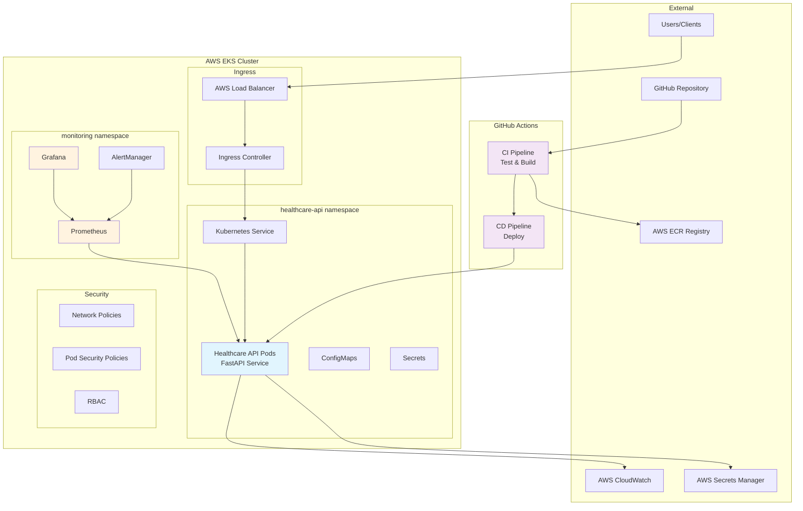

# Healthcare Prediction API - DevOps Assignment

## 📋 Overview

This project implements a production-grade healthcare prediction API with comprehensive DevOps practices including containerization, CI/CD pipelines, monitoring, and security best practices.

## 🏗️ Architecture



## 🚀 Features

### API Endpoints
- **GET /health** - Health check endpoint with uptime and service status
- **GET /predict** - Mock prediction endpoint returning healthcare scores
- **GET /metrics** - Prometheus metrics for monitoring
- **GET /** - API information and available endpoints

### Production-Grade Features
- **Multi-stage Docker builds** for optimized images
- **Non-root container execution** for enhanced security
- **Comprehensive health checks** (startup, readiness, liveness)
- **Horizontal Pod Autoscaling** based on CPU/memory metrics
- **Rolling updates** with zero downtime deployments
- **Resource limits and requests** for proper resource management
- **Security contexts** and pod security policies

## 🔧 Quick Start

### Prerequisites
- AWS CLI configured with appropriate permissions
- kubectl configured for EKS cluster
- Docker installed locally
- GitHub account with repository access

### 1. Local Development

```bash
# Clone the repository
git clone https://github.com/your-org/healthcare-prediction-api.git
cd healthcare-prediction-api

# Install dependencies
pip install -r requirements.txt

# Run tests
pytest test_app.py -v

# Run locally
python app.py
```

### 2. Build and Test Docker Image

```bash
# Build development image
docker build -f Dockerfile.dev -t healthcare-api:dev .

# Run container
docker run -p 8000:8000 healthcare-api:dev

# Test endpoints
curl http://localhost:8000/health
curl http://localhost:8000/predict
```

### 3. Deploy to Kubernetes

```bash
# Apply Kubernetes manifests
kubectl apply -f k8s/ --recursive

# Check deployment status
kubectl get pods -n healthcare-api
kubectl rollout status deployment/healthcare-prediction-api -n healthcare-api

# Get service endpoint
kubectl get svc -n healthcare-api
```

## 🔄 CI/CD Pipeline

### Continuous Integration (CI)
The CI pipeline automatically triggers on:
- Push to `main` or `develop` branches
- Pull requests to `main` or `develop`

**CI Steps:**
1. **Security Scanning** - Trivy vulnerability scanner, Bandit security analysis
2. **Code Quality** - Linting with flake8, black formatting, import sorting
3. **Testing** - Unit tests with coverage reporting
4. **Build & Push** - Multi-architecture Docker image build and push to ECR
5. **Image Scanning** - Container vulnerability scanning

### Continuous Deployment (CD)
The CD pipeline deploys to production on successful CI completion for the `main` branch.

**CD Steps:**
1. **AWS Authentication** - Configure credentials and EKS access
2. **Kubernetes Deployment** - Apply manifests with rolling update strategy
3. **Verification** - Health checks and smoke tests
4. **Notifications** - Slack notifications for deployment status

### Security in CI/CD
- **No secrets in code** - All credentials stored in GitHub Secrets
- **Image signing** - Container images signed and verified
- **OIDC integration** - Secure AWS authentication without long-lived credentials
- **Security scanning** - Multiple layers of vulnerability detection

## 📊 Monitoring & Alerting

### Metrics Collection
- **Prometheus** - Application and infrastructure metrics
- **CloudWatch** - AWS native monitoring and logging
- **Container Insights** - EKS cluster and pod metrics

### Key Metrics Monitored
- **Application Performance**: Request rate, response time, error rate
- **Infrastructure**: CPU, memory, disk usage, network traffic
- **Business Metrics**: Prediction requests, health check status
- **Security Events**: Failed authentication, suspicious activities

### Dashboards
- **Grafana Dashboard** - Real-time application and infrastructure monitoring
- **CloudWatch Dashboard** - AWS service monitoring and alerting

### Alerts Configured
1. **High CPU Usage** (>80% for 5 minutes) - Warning
2. **High Memory Usage** (>85% for 5 minutes) - Warning  
3. **Health Check Failures** (>2 minutes) - Critical
4. **High Error Rate** (>5% for 3 minutes) - Critical
5. **Slow Response Times** (95th percentile >2s) - Warning
6. **Pod Restart Events** - Warning

### Alert Routing
- **Critical alerts** → Email + Slack with @channel notification
- **Warning alerts** → Slack notifications
- **Recovery notifications** → All configured channels

## 🔒 Security Implementation

### Infrastructure Security
- **IAM Least Privilege** - Minimal permissions for each component
- **Pod Security Standards** - Restricted security contexts enforced
- **Network Policies** - Micro-segmentation between services
- **Service Mesh (Istio)** - mTLS encryption for all service communication

### Application Security
- **Non-root execution** - Containers run as unprivileged user (UID 1000)
- **Read-only root filesystem** - Prevents runtime modifications
- **Security scanning** - Multi-layer vulnerability detection
- **Secrets management** - AWS Secrets Manager integration

### Secret Management
- **AWS Secrets Manager** - Centralized secret storage
- **External Secrets Operator** - Automatic secret sync to Kubernetes
- **IRSA (IAM Roles for Service Accounts)** - Secure AWS API access
- **Sealed Secrets** - GitOps-friendly encrypted secrets

### Runtime Security
- **Falco** - Runtime threat detection
- **OPA Gatekeeper** - Policy enforcement
- **Image security policies** - Signed and verified container images
- **Network segmentation** - Controlled ingress/egress traffic

## 📁 Project Structure

```
healthcare-prediction-api/
├── app.py                          # Main FastAPI application
├── test_app.py                     # Comprehensive test suite
├── requirements.txt                # Python dependencies
├── Dockerfile                      # Production multi-stage build
├── Dockerfile.dev                  # Development image
├── .dockerignore                   # Docker build exclusions
├── .github/
│   └── workflows/
│       ├── ci-cd.yml              # Main CI/CD pipeline
│       └── dev-ci.yml             # Development branch CI
├── k8s/                           # Kubernetes manifests
│   ├── 00-namespace.yaml          # Namespace and basic configs
│   ├── 01-deployment.yaml         # Application deployment
│   ├── 02-service.yaml            # Kubernetes services
│   ├── 03-ingress.yaml            # Ingress configuration
│   ├── 04-rbac.yaml               # RBAC policies
│   ├── 05-autoscaling.yaml        # HPA and PDB
│   └── 06-network-policy.yaml     # Network policies
├── monitoring/                    # Monitoring configuration
│   ├── prometheus-config.yaml     # Prometheus setup
│   ├── grafana-dashboard.json     # Grafana dashboard
│   ├── cloudwatch-config.yaml    # CloudWatch integration
│   └── alertmanager.yml          # Alert configuration
├── security/                     # Security configurations
│   ├── iam.tf                    # Terraform IAM setup
│   ├── security-policies.yaml    # K8s security policies
│   ├── external-secrets.yaml     # Secret management
│   └── security-scanning.yaml    # Security scanning config
└── README.md                     # This documentation
```

## 🛠️ Deployment Steps

### 1. Infrastructure Setup

```bash
# Deploy AWS infrastructure with Terraform
cd security/
terraform init
terraform plan
terraform apply

# Install required K8s operators
kubectl apply -f https://github.com/external-secrets/external-secrets/releases/latest/download/bundle.yaml
```

### 2. Configure Secrets

```bash
# Store secrets in AWS Secrets Manager
aws secretsmanager create-secret \
    --name "healthcare-api/production" \
    --description "Healthcare API production secrets" \
    --secret-string '{"database_url":"postgresql://...","api_key":"...","jwt_secret":"..."}'
```

### 3. Deploy Application

```bash
# Deploy to Kubernetes
kubectl apply -f k8s/ --recursive

# Verify deployment
kubectl get all -n healthcare-api
```

### 4. Setup Monitoring

```bash
# Deploy monitoring stack
kubectl apply -f monitoring/ --recursive

# Access Grafana (port-forward for initial setup)
kubectl port-forward -n monitoring svc/grafana 3000:80
```

## 🧪 Testing Strategy

### Unit Tests
- **API endpoint testing** - Verify response structure and status codes
- **Business logic testing** - Validate prediction logic
- **Error handling testing** - Ensure proper error responses
- **Performance testing** - Response time validation

### Integration Tests
- **Container testing** - End-to-end container functionality
- **Kubernetes testing** - Health checks and readiness probes
- **Monitoring integration** - Metrics collection verification

### Security Testing
- **Vulnerability scanning** - Container and dependency scanning
- **Penetration testing** - API security validation
- **Compliance testing** - Security policy enforcement

## 📈 Performance Characteristics

### Scalability
- **Horizontal scaling** - 3 to 20 pods based on load
- **Resource efficiency** - Optimized memory and CPU usage
- **Load balancing** - Traffic distributed across healthy pods

### Reliability
- **High availability** - Multi-pod deployment with disruption budget
- **Health monitoring** - Comprehensive health check coverage
- **Graceful degradation** - Service continues during partial failures

### Performance Targets
- **Response time** - < 100ms for health checks, < 500ms for predictions
- **Throughput** - > 1000 requests/second per pod
- **Availability** - 99.9% uptime target
- **Recovery time** - < 5 minutes for service restoration

## 🔍 Troubleshooting

### Common Issues

**Pod startup failures:**
```bash
kubectl describe pod <pod-name> -n healthcare-api
kubectl logs <pod-name> -n healthcare-api
```

**Service connectivity issues:**
```bash
kubectl get endpoints -n healthcare-api
kubectl exec -it <pod-name> -n healthcare-api -- curl localhost:8000/health
```

**Monitoring gaps:**
```bash
kubectl logs -n monitoring <prometheus-pod>
kubectl get servicemonitor -n healthcare-api
```

### Health Check Endpoints
- **Application health**: `GET /health`
- **Kubernetes readiness**: `GET /health`
- **Kubernetes liveness**: `GET /health`
- **Metrics**: `GET /metrics`

## 📞 Support

### Team Contacts
- **DevOps Team**: devops-team@healthcare.com
- **Security Team**: security@healthcare.com
- **On-call Support**: +1-555-0123

### Resources
- **Documentation**: [Internal Wiki](https://wiki.healthcare.com/api)
- **Monitoring**: [Grafana Dashboard](https://grafana.healthcare.com)
- **Alerts**: #healthcare-alerts Slack channel
- **Incident Response**: [Runbook](https://runbook.healthcare.com)

## 📝 Contributing

1. Fork the repository
2. Create a feature branch (`git checkout -b feature/amazing-feature`)
3. Commit changes (`git commit -m 'Add amazing feature'`)
4. Push to the branch (`git push origin feature/amazing-feature`)
5. Open a Pull Request

### Development Guidelines
- Follow PEP 8 style guidelines
- Write comprehensive tests for new features
- Update documentation for any API changes
- Ensure security scanning passes
- Add appropriate monitoring and alerting

---

## 🏆 Assignment Completion Summary

✅ **API Service** - FastAPI with /health and /predict endpoints  
✅ **Production Dockerfile** - Multi-stage, non-root, healthchecks  
✅ **Kubernetes Deployment** - Complete K8s manifests with security  
✅ **CI/CD Pipeline** - GitHub Actions with testing, building, deployment  
✅ **Monitoring** - Prometheus, Grafana, CloudWatch with alerts  
✅ **Security** - IAM least privilege, secrets management, HTTPS  
✅ **Documentation** - Comprehensive README with architecture diagram  

**Total Estimated Setup Time**: 4-6 hours for complete deployment  
**Maintenance Overhead**: < 1 hour/week with automated monitoring